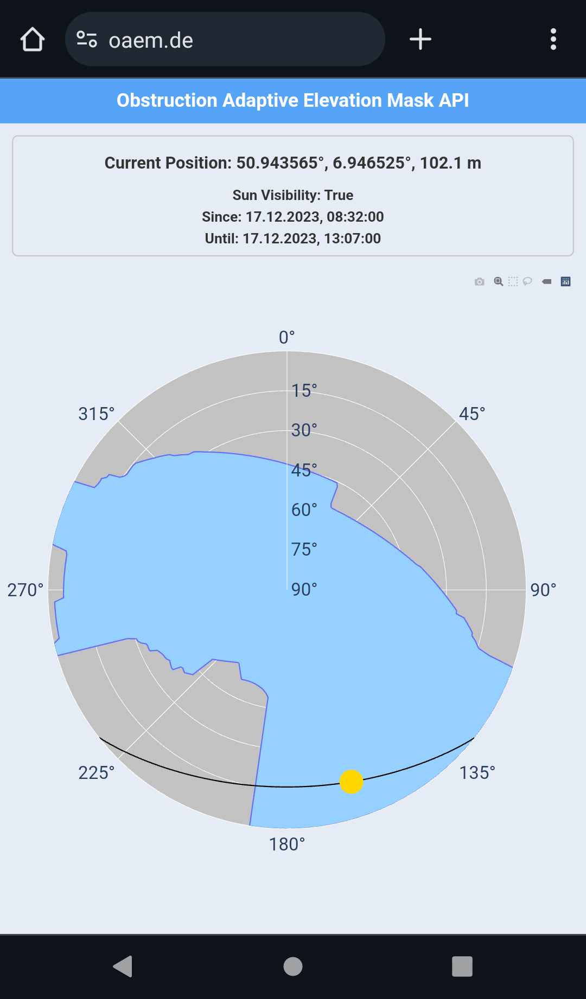

<div align="center">
<h1>Obstruction Adaptive Elevation Mask API</h1>

#### API to query an Obstruction Adaptive Elevation Mask (OAEM) for a given position using CityGML models.

Demo: [http://oaem.de](http://oaem.de)


</div>

The plot you can see here is a so-called skyplot that depicts the view into the sky from a given position. The position of an object in this plot is described using azimuth (i.e. north 0°, east 90°, south 180°, west 270°) and elevation (0° horizon, 90° zenith). The grey area shows the blockage of the free sky view (blue) due to buildings. The yellow circle is the current position of the sun along its trajectory (black).

The darkblue outline of the sky view is called Obstruction Adaptive Elevation Mask (OAEM) [[Zimmermann 2019]](https://www.researchgate.net/publication/329833465_GPS-Multipath_Analysis_using_Fresnel-Zones). It is possible to compute this OAEM from the user position because of existing CityGML databases. CityGML models are XML based representations of buildings and can either be retrieved from [local file storage](https://www.opengeodata.nrw.de/produkte/geobasis/3dg/lod2_gml/lod2_gml/) or from [Web-Feature-Services (WFS)](https://www.wfs.nrw.de/geobasis/wfs_nw_3d-gebaeudemodell_lod1). This data exists for most german or international cities, however, they are not always free. The code is designed for LOD1 or LOD2 building models from Geobasis NRW, Germany. In its current state, it is therefore only applicable within North Rhine-Westphalia, Germany.

An OAEM can be useful in various scenarios, e.g. GNSS Signal filtering:


# Installation

Use docker compose to start the application. The following command will start the application on port 4326.

```bash
version: '3.8'

services:
  frontend:
    image: gtombrink/oaem-web:latest

  backend:
    image: gtombrink/oaem-api:latest

  reverse-proxy:
    image: nginx
    depends_on:
      - frontend
      - backend
    ports:
      - "4326:80"
    volumes:
      - ./nginx.conf:/etc/nginx/nginx.conf:ro
```

Sample nginx.conf:

```nginx
worker_processes 1;

events {
    worker_connections 1024;
}

http {
    sendfile on;

    client_max_body_size 20M;

    server {
        listen 80;

        location / {
            proxy_pass http://frontend:3000/;
        }

        location /api/ {
            rewrite ^/api(/.*)$ $1 break;
            proxy_pass http://backend:8000/;
            proxy_set_header Host $host;
            proxy_set_header X-Real-IP $remote_addr;
            proxy_set_header X-Forwarded-For $proxy_add_x_forwarded_for;
            proxy_set_header X-Forwarded-Proto $scheme;
        }
    }
}
